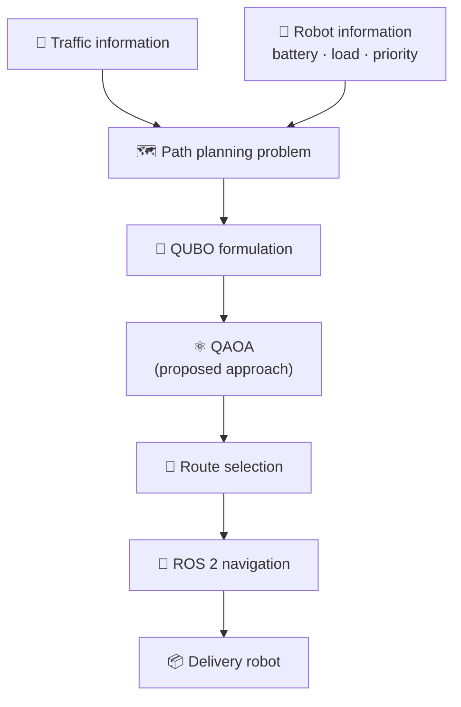
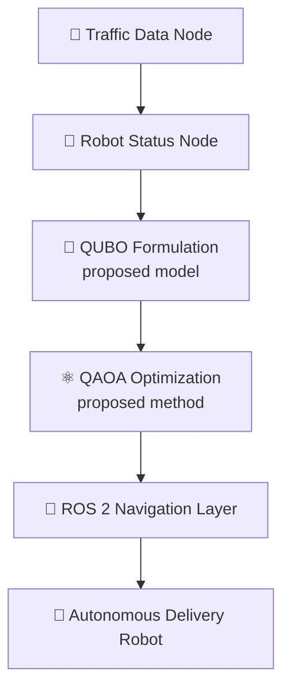

<div align="center">

# ⚛️ QUANTUM × ROBOTICS 🤖

### Quantum-Enhanced Traffic-Aware Path Planning for Autonomous Delivery Robots

**What if a delivery robot could pick its route with quantum optimization?**
A conceptual research study on **QAOA** + **QUBO** + **ROS 2**.


</div>

---

> ⚠️ **Honest note:** this is a **conceptual study**. It has **not** been
> implemented, simulated or experimentally validated, and it makes **no claim**
> that QAOA beats classical path planning.

---

## 🧠 The idea in 10 seconds

Delivery robots have to pick routes while juggling **traffic, battery,
priority, deadlines, load and other robots**. As routes and constraints pile
up, the problem gets harder.

This project asks one question:

> **Can this be written as a QUBO problem and explored with QAOA?**

## 🎯 Problem statement

Autonomous delivery robots may need to select suitable routes while dealing
with changing traffic conditions, limited battery capacity, delivery
priorities, and the presence of other robots. As the number of possible routes
and constraints increases, the path-planning problem can become more complex.

This project explores whether such a problem could potentially be represented
as a **QUBO optimization problem** and investigated using **QAOA**.

## 🧩 Proposed approach



*This is the **proposed concept**, not an implemented system.*

## 🧮 QUBO formulation

The path-selection problem is conceptually written as:

$$
C(x) = \sum_{i,j} w_{ij}\, x_i x_j + \sum_i h_i\, x_i
$$

| Symbol | Meaning |
| --- | --- |
| $x_i$ | Binary route-selection variables |
| $w_{ij}$ | Costs or interactions between route segments |
| $h_i$ | Individual costs and constraint-related terms |

**Factors the formulation considers**

- 🚦 Traffic conditions
- 🔋 Battery level
- 🎯 Delivery priority
- ⏱️ Delivery deadlines
- 📦 Robot load
- 🛣️ Route availability
- 🤝 Multi-robot coordination

The formulation is part of the **conceptual study** and requires further
implementation and testing.

## 🏗️ Proposed system architecture



## 🔬 Research objectives

1. 🧩 Understand whether robot path planning can be formulated as a **QUBO** problem
2. ⚛️ Explore **QAOA** as a possible optimization method
3. 🔗 Propose a basic architecture connecting quantum optimization concepts with **ROS 2**
4. 🚦 Consider traffic and robot-specific constraints in route selection
5. 🔭 Identify directions for future implementation and experimentation

## 📊 Current status

| Area | Status |
| --- | --- |
| Concept development | ✅ Completed |
| Problem study | ✅ Completed |
| Proposed architecture | ✅ Completed |
| QUBO formulation | 🟡 Conceptual |
| QAOA implementation | ⬜ Not implemented |
| ROS 2 integration | ⬜ Not implemented |
| Simulation | ⬜ Not performed |
| Hardware testing | ⬜ Not performed |
| Experimental validation | ⬜ Not performed |

## 🚧 Limitations

The approach has not been tested in simulation or on a physical robot. Areas
that need further investigation:

- Practical implementation of the QUBO formulation
- Scalability for larger path-planning problems
- QAOA performance on the proposed problem
- Comparison with classical path-planning methods
- Real-time traffic data integration
- Computational requirements
- Integration with an actual ROS 2 navigation system

Therefore, **no conclusion is made** about whether QAOA would provide an
advantage over existing classical approaches.

## 🗺️ Roadmap (future work)

- [x] Concept development
- [x] Problem study
- [x] Proposed architecture
- [ ] Implement the proposed QUBO model
- [ ] Test the model with classical optimization methods
- [ ] Experiment with QAOA simulators
- [ ] Study the effect of increasing problem size
- [ ] Integrate the optimization approach with ROS 2
- [ ] Build a multi-robot simulation environment
- [ ] Compare results with classical path-planning methods
- [ ] Eventually test on a physical robot

## 🕰️ Timeline

| Date | Event |
| --- | --- |
| **04 Oct 2025** | Concept and research work carried out |
| Later | Repository published to document and preserve the work |

## 📁 Repository contents

```text
quantum_research/
├── PROJECT-2_GitHub.pdf
└── README.md
```

📄 **[PROJECT-2_GitHub.pdf](./PROJECT-2_GitHub.pdf)** is the original conceptual
research document: methodology, mathematical formulation, system architecture,
limitations and future scope.

## 👥 Team

| | |
| --- | --- |
| **Deepak K** | Dept. of Electrical and Electronics Engineering, New Horizon College of Engineering, Bangalore, India |
| **A M Likhitha** | Dept. of Electrical and Electronics Engineering, New Horizon College of Engineering, Bangalore, India |

Developed as a collaborative conceptual research study by the two team members.

## 🏷️ Research areas

`Quantum Computing` · `Robotics` · `ROS 2` · `QAOA` · `QUBO` · `Path Planning` · `Autonomous Systems`

---

<div align="center">

**Status:** Conceptual Research, Proposed Approach
**Concept date:** 04 October 2025
**Implementation / experimental validation:** not yet performed

*Big idea. Honest status. Next step: build it.* ⚛️🤖

</div>
